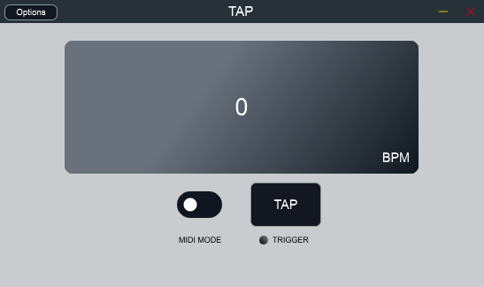

#TAP
TAP is what it is—a VST plugin that uses both MIDI and Mouse Inputs to estimate the Tempo of any song. If you produce music like I do sometimes, there are situations where you might want to get the tempo of a song. Trying to do this manually is hard and frustrating! By sending triggers from your MIDI keyboard or through your mouse by clicking on a button, you can get the tempo of any song. TAP's accuracy is your accuracy; so tap precisely :-).

## Demo Video
I do not have a demo video of TAP yet! But I will update this soon, I presume.

## Todo
---
- Automated tempo estimation using an envelope follower or pulse detectuion of some sort???
- Automated tempo estimation of audio or MIDI using an AI model (I have to read some papers, build a model for this, and test it thoroughly).
---

## Minimum System Requirements
#### Building TAP
- C++ Standard: 17
- Windows: Visual Studio 2019 or Higher
Note that TAP can be built for Linux and Android as well. In my case, I built it on Windows without issues

## Contributing
If you want to contribute, please send me a pull request! If you want to also modify the code for your use, feel free to do so. A shoutout will be appreciated as well :-).

## Licensing
To the best of my knowledge, you can build this plugin for your own personal use. I have not made a release yet, and I am not sure I would. I might change my mind once I fully understand the idiosyncrasies that come with Licensing with JUCE.
